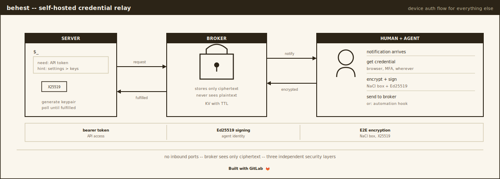

# behest

[](https://gitlab.com/nomograph/behest/-/pipelines)
[](LICENSE)


Device Authorization Flow for services that don't implement it.

A server process needs a credential. Getting it requires a browser, a
human, and maybe MFA. The server can't do any of that. behest lets it
ask a human, wait, and receive the credential back, encrypted
end-to-end, without either side opening an inbound port.

## How it works

```
Your server                    Cloudflare Worker              Your laptop
(container, CI, etc.)          (the broker)                   (tray agent)
                                                              
1. Generate X25519 keypair                                    
2. POST /v1/requests ─────────> Store request ──────────────> Desktop notification
   { service, message,          Fire notifiers (ntfy, etc.)   "my-app needs a token"
     hint, public_key }                                       
                                                              3. Human gets the credential
3. Poll GET /v1/requests/{id}                                    (browser, password manager,
   ...waiting...                                                  wherever it lives)
   ...waiting...                                              
                                                              4. Agent encrypts credential
                                 <──────────────────────────     with server's public key
                                Store encrypted blob             (NaCl box, X25519)
                                                              
4. GET returns fulfilled ◄──── Return encrypted blob          
5. Decrypt with private key                                   
6. Use the credential                                         
```

The broker stores only ciphertext. It never sees the plaintext credential.
Both your server and your laptop talk outbound to the broker. No inbound
connections, no VPN, no port forwarding.

## The problem this solves

Many services have moved to browser-only OAuth, killed API key flows,
or added CAPTCHAs. A headless container cannot authenticate to them.
The workarounds are all bad: manually pasting tokens (breaks on expiry),
running Chromium in the container (600MB, fragile, fails on CAPTCHA),
SSH port forwarding (operational nightmare).

RFC 8628 (Device Authorization Grant) solves this elegantly for services
that implement it. Most services never will. behest is that pattern,
self-hosted, for everything else.

## Components

| Directory | Language | What it is |
|-----------|----------|------------|
| `worker/` | TypeScript | Cloudflare Worker broker (~300 lines) |
| `agent/` | Rust | Laptop agent: system tray, notifications, encryption, signing |
| `sdk/` | Go | Client library for requesting services |
| `spec/` | Markdown | Wire protocol specification |

## Security

Three layers, each independent:

| Layer | Protects against | How |
|-------|-----------------|-----|
| **Bearer token** | Unauthorized API access | Shared secret on every request |
| **Agent signing** | Unauthorized fulfillment | Ed25519 keypair per agent, stored in macOS Keychain |
| **E2E encryption** | Broker compromise, network eavesdropping | Ephemeral X25519 + NaCl box per request |

A stolen bearer token lets an attacker create requests and poll them,
but not fulfill them (requires the agent's Ed25519 private key, which
never leaves Keychain). A compromised broker sees encrypted blobs (no
plaintext). A network observer sees TLS.

**IP-bound credentials:** behest delivers credentials as opaque bytes. It
does not proxy network traffic. Most API tokens and bearer tokens work
from any IP. If a credential is IP-bound (session cookies, IP-pinned
tokens), ensure the requester shares an exit IP with the operator (e.g.
via Tailscale or Cloudflare WARP). The `on_request_hook` can also obtain
credentials from the requester's network directly (e.g. via SSH).

## Setup

### Prerequisites

- A Cloudflare account (free tier is sufficient)
- Rust toolchain (`cargo`)
- Node.js + npm (for the Worker)
- Go 1.22+ (for the SDK, only if your services use Go)

### Step 1: Deploy the broker

The quick way (one command, handles everything):

```bash
cd worker && ./setup.sh
```

This creates the KV namespace, generates a master key, sets the secret,
and deploys. It prints the broker URL and master key at the end. Save both.

<details>
<summary>Manual setup (if you prefer step-by-step)</summary>

```bash
cd worker
npm install

# Create the KV namespace (stores requests)
npx wrangler kv namespace create REQUESTS
# Output: { binding = "REQUESTS", id = "abc123..." }

npx wrangler kv namespace create REQUESTS --preview
# Output: { binding = "REQUESTS", preview_id = "def456..." }
```

Edit `wrangler.toml` and paste the two IDs:

```toml
[[kv_namespaces]]
binding = "REQUESTS"
id = "abc123..."        # <-- paste here
preview_id = "def456..."  # <-- paste here
```

Set your master key. This is the single secret that controls access.
Generate something strong (e.g. `openssl rand -hex 32`):

```bash
npx wrangler secret put AUTH_TOKEN
# Paste your key when prompted
```

Optionally configure notifications so the agent gets push alerts.
Edit the `NOTIFIERS` variable in `wrangler.toml`:

```toml
# ntfy (self-hostable push notifications)
NOTIFIERS = '[{"type":"ntfy","url":"https://ntfy.sh/your-private-topic"}]'
```

Deploy:

```bash
npx wrangler deploy
# Output: https://behest.<your-account>.workers.dev
```

Note the URL. You'll need it for enrollment.

</details>

### Step 2: Build and enroll the agent

```bash
cd agent
cargo build --release
```

Enroll with your broker. Two arguments: the broker URL and the master
key you set in Step 1:

```bash
./target/release/behest-agent enroll https://behest.your-account.workers.dev YOUR_MASTER_KEY
```

This does four things:
1. Generates an Ed25519 signing keypair
2. Stores the private key in macOS Keychain (with file backup at `~/.config/behest/agent.key`)
3. Registers the public key with the broker
4. Writes `~/.config/behest/agent.toml` with the broker URL and auth token

You can verify it worked:

```bash
./target/release/behest-agent status
```

### Step 3: Verify the deployment

Run the smoke test to confirm the full flow works:

```bash
# Automated (no agent interaction needed):
BEHEST_URL=https://behest.your-account.workers.dev BEHEST_KEY=YOUR_MASTER_KEY make smoke-test

# Interactive (creates a request, you fulfill it from the agent):
BEHEST_URL=https://behest.your-account.workers.dev BEHEST_KEY=YOUR_MASTER_KEY make smoke-test-interactive
```

### Step 3: Run the agent

```bash
# As a tray app (shows in macOS menu bar)
./target/release/behest-agent

# Or headless (for SSH sessions, Linux, etc.)
./target/release/behest-agent run --headless
```

To start automatically at login on macOS:

```bash
make install-service    # installs a launchd plist
make uninstall-service  # removes it
```

### Step 4: Use from your services

In a Go service:

```go
package main

import (
    "context"
    "fmt"
    "os"

    "gitlab.com/nomograph/behest/sdk"
)

func main() {
    client := behest.NewClient("https://behest.your-account.workers.dev")
    client.AuthToken = os.Getenv("BEHEST_KEY")

    ctx := context.Background()

    req, err := client.CreateRequest(ctx,
        "my-app",                              // service name (shown in notification)
        "Need the production API token",       // message (what's needed)
        "Log in to app.example.com, Settings > API Keys, copy the prod key",  // hint (how to get it)
    )
    if err != nil {
        panic(err)
    }

    fmt.Printf("Waiting for credential (request %s)...\n", req.ID)

    // Blocks until a human fulfills the request or the context is canceled
    credential, err := req.Wait(ctx, behest.DefaultPollInterval)
    if err != nil {
        panic(err)
    }

    fmt.Printf("Got credential: %s\n", string(credential))
}
```

The `BEHEST_KEY` environment variable is the same master key from Step 1.

For other languages, the protocol is HTTP + JSON. See
[spec/protocol.md](spec/protocol.md) for the full wire protocol, or use
the Go SDK as a reference implementation.

## Agent commands

| Command | What it does |
|---------|-------------|
| `behest-agent` | Run as system tray daemon (default) |
| `behest-agent run --headless` | Run without GUI (terminal, SSH, Linux) |
| `behest-agent enroll <url> <key>` | Enroll this machine with a broker |
| `behest-agent status` | Show identity, broker connectivity, pending count |
| `behest-agent list` | Show all pending credential requests |
| `behest-agent fulfill <id>` | Fulfill a request (prompts for credential) |
| `behest-agent fulfill <id> -c "val"` | Fulfill with an inline value |
| `behest-agent rotate-key` | Generate a new signing key and re-enroll |
| `behest-agent --version` | Show version |

When running as a tray app, pending requests appear as clickable menu
items. Clicking one opens Terminal with the fulfill command.

## Automation hooks

The agent can run a shell command when a new request arrives. If the
command writes a credential to stdout and exits 0, the agent submits it
automatically. If it exits non-zero or produces no output, the request
stays pending for manual fulfillment.

```toml
# ~/.config/behest/agent.toml
on_request_hook = "~/.config/behest/hooks/auto-fulfill.sh"
```

The hook receives the request as JSON in the `BEHEST_REQUEST_JSON`
environment variable. Parse it with `jq` or similar. Do not
shell-expand it directly: the `service`, `message`, and `hint` fields
are set by the requester and could contain anything.

## Configuration reference

### Broker (`wrangler.toml` + secrets)

| Setting | Where | Default | Description |
|---------|-------|---------|-------------|
| `AUTH_TOKEN` | `wrangler secret` | (none) | Master key for all API access. Required in production. |
| `REQUEST_TTL_SECONDS` | `[vars]` | `600` | How long a request lives before expiry (seconds) |
| `MAX_CREDENTIAL_BYTES` | `[vars]` | `65536` | Maximum credential size (bytes) |
| `NOTIFIERS` | `[vars]` | `[]` | JSON array of notifier configs |

### Agent (`~/.config/behest/agent.toml`)

| Setting | Default | Description |
|---------|---------|-------------|
| `broker_url` | (required) | Broker URL |
| `auth_token` | (none) | Bearer token (set automatically by `enroll`) |
| `poll_interval_secs` | `2` | How often to check for new requests |
| `on_request_hook` | (none) | Shell command for automatic fulfillment |

### Notifier config

The `NOTIFIERS` variable is a JSON array. Each entry has a `type` and
type-specific fields:

```json
[
  {
    "type": "ntfy",
    "url": "https://ntfy.sh/your-private-topic"
  },
  {
    "type": "webhook",
    "url": "https://example.com/my-webhook",
    "headers": { "X-Custom": "value" }
  }
]
```

The notification payload includes the request ID, service name, message,
broker URL, and timestamps. It never includes credentials.

## Protocol

See [spec/protocol.md](spec/protocol.md) for the complete wire protocol,
including all endpoints, request/response schemas, encryption details,
and the Ed25519 signing protocol.

The short version: standard NaCl `crypto_box` (X25519 + XSalsa20-Poly1305)
with Ed25519 signing. All keys and ciphertext are base64url-encoded. Any
language with NaCl and Ed25519 bindings can implement a client.

## License

MIT
